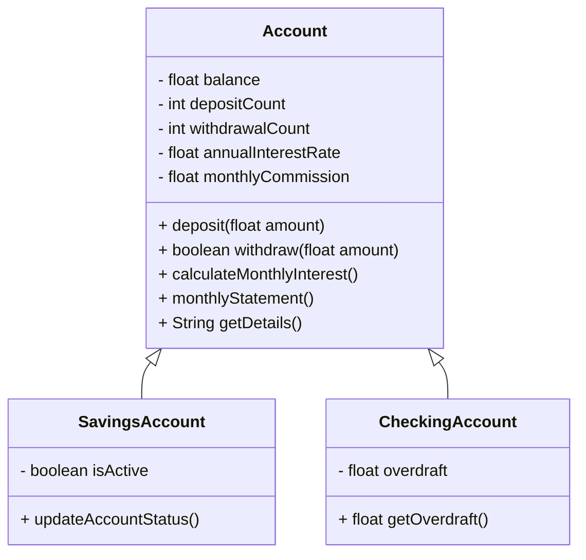

# Bank Account System

This project implements a **bank account system** in **Java 21**, following **SOLID principles** and using **JUnit 5** for unit testing.

## 📌 Features

- **Base Account (`Account`)**: Manages deposits, withdrawals, interest calculations, and monthly statements.
- **Savings Account (`SavingsAccount`)**: Checks whether the account is active based on a minimum balance.
- **Checking Account (`CheckingAccount`)**: Allows overdrafts and handles them automatically.

---

## 📊 UML - Class Diagram



---

## 🚀 Technologies Used

- **Java 21**
- **JUnit 5** (for unit testing)
- **Mermaid** (for UML diagrams)

---

## 💂️ Running Tests

To run the unit tests, use:

```sh
mvn test
```

Ensure you have **Maven** installed and properly configured.


---

## 👨‍💻 Author

**Olena Myroshnykova**


